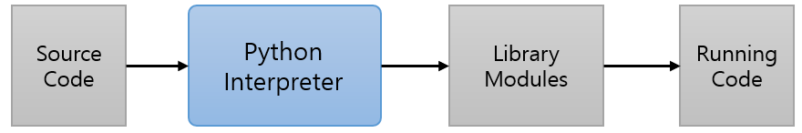

= Python 인터프리터

* Python은 인터프리터를 사용하는 언어로 알려져있으나, Python 인터프리터 내부에는 컴파일러와 Python 가상 머신(PVM)이 있음
* 소스코드(.py)에 대해 컴파일러가 바이트코드(.pyc)로 변환하고, 이를 한줄씩 PVM이 해석하는 과정을 거침
* Python 코드 실행 시 __pycache__ 라는 디렉토리가 생기고 그 안에 .pyc 파일들이 생성되어 실행됨

image:../images/image01.png[]

---

Python은 인터프리터 언어로, 작성된 소스 코드를 인터프리터가 한 줄씩 읽어들여 읽은 한 줄의 코드를 즉시 실행하는 방식으로 실행됩니다. 개발자 관점에서 Python 실행 환경은 아래와 같이 취급됩니다.

Python 인터프리터의 실제 동작은, Node.js등의 일반적인 인터프리터와 다릅니다. Node.js는 읽어들인 코드를 기계어 코드(Machine code)로 직접적으로 번환합니다. 하지만 Python은 플랫폼에서 직접적으로 동작하는 기계어 코드로 직접 변환하지 않고 bytecode로 변환합니다. 이 변환된 코드는 Virtual Machine에 의해 실행됩니다.

image:../images/image01.png[width=500]

입력 코드를 bytecode로 변경할 경우 Java, .NET Framework등의 환경과 마찬가지로 플랫폼에 독립적인 특성을 가지게 됩니다. 이 경우 바이트코드를 실행할 Virtual Machine만 있으면 어떤 플랫폼에서도 사용할 수 있습니다.

확장자가 .pyc인 bytecode는 디스어셈플러를 통해 확인할 수 있습니다. bytecode는 당연히 일반적인 소스코드 형태와는 다릅니다.

[cols="1a"]
|===
|**참고** 컴파일러는 변경 대상 및 결과에 따라 다음과 같이 4가지로 나뉩니다.

* Static compile: 입력 코드를 바로 기계어로 변환
* Bytecode compile: 입력 코드를 바이트코드로 변환
* AOT(Ahead Of Comipile) compile: 바이트 코드 등의 중간 코드를 기계어로 변환
* JIT(Just-in-time) compile: 실행시 최초 한 번에 한해 컴파일
|===

bytecode의 생성 과정은 Python 인터프리터의 종류에 따라 다릅니다. 파이썬은 환경에 따라 CPython, Jython, Pypy등의 다양한 인터프리터를 사용할 수 있으며, 기본적으로 Python은 CPython 인터프리터를 사용하며, 각 인터프리터에 따라 bytecode를 생성하는 과정은 조금씩 다릅니다.

CPython 인터프리터에서 bytecode를 생성하는 과정은 아래와 같습니다.

1. 미리 정해진 규칙으로 소스코드를 parse tree로 변경
2. parse tree를 AST로 변경
3. AST를 CFG(Control Flow Graph)로 변경
4. CFG를 참조하여 bytecode 생성

== Python 코드의 실행 과정

파이선 코드는 인터프리터의 일부인 컴파일러에 의해 bytecode로 변환되며, Python Virtual Machine이 bytecode를 한 줄씩 읽어 기계어로 변환하여 실행합니다.

Python 코드의 실행 과정은 아래와 같습니다.

1. Python 소스코드 컴파일 과정을 시작
2. Syntax Error가 발견되면 오류 메시지를 남기고 컴파일을 중단
3. Python 소스코드가 bytecode로 변환됨
4. Python VM은 bytecode에서 요청되는 input과 library를 로드
5. Python VM(Virtual Machine)이 bytecode를 한줄씩 처리하면서 실행
6. VM이 bytecode를 실행하면서 런타임 오류가 발생하면 오류 메시지를 남기고 실행을 중단

link:./06_python_interpreter.adoc[이전: Python 인터프리터] +
link:./08_python_virtual_machine.adoc[다음: Python Virtual Machine]

https://linejin.tistory.com/2

https://caiocozza-art.medium.com/a-quick-overview-of-the-python-virtual-machine-pt-1-315e74c036f4

https://letsmakemyselfprogrammer.tistory.com/88

