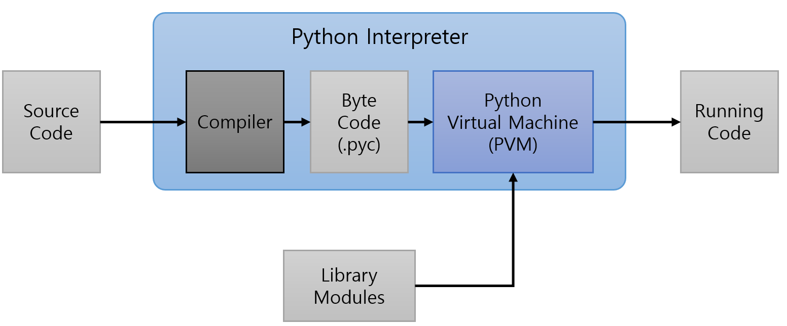

= Python Virtual Machine

---

Python은 단지 **C 프로그램** 입니다 . 이 프로그램은 Python Virtual Machine이라고도 하며, 이 가상 머신은 Python 코드가 실제로 실행되기 전에 여러 가지 작업을 해야 합니다. 가상 머신은 Python 파일에 작성한 대로 Python 코드를 실행할 수 없습니다. 전체 Python 코드를 가상 머신이 이해할 수 있는 것으로 **구문 분석** 해야 합니다.

1. Python 가상 머신은 모든 필수 종속성을 로드하고 모든 필수 내용을 설정합니다. 이는 Py_Initialize 함수에 의해 수행됩니다.
2. 이 초기화 후, run_file 이라는 함수가 실행되어 Python 스크립트를 로드합니다.
3. Py_Main은 PyRun_SimpleFileExFlags를 실행 하고 Python 프로그램의 `\__main__` 네임스페이스를 생성합니다 .
4. PyParser_ASTFromFileObject가 호출되고 PyParser_ParseFileObjects 를 호출합니다 . 이들은 나중에 명령어로 변환될 파스 객체 트리를 생성하는데, 이름인 트리는 이러한 객체가 다른 객체에 대한 포인터를 보유한다는 것을 암시합니다.
5. 파싱의 마지막 단계가 될 PyParser_ASTFromNodeObject를 호출합니다. AST는 추상 구문 트리(Abstract Syntax Tree) 이며, 파이썬 코드에서도 이 부분에 접근할 수 있습니다. 파이썬 프로그램을 위한 뛰어난 메타 프로그래밍 기술이며, Julia 와 LUA 와 같은 다른 구현과도 비슷합니다. 또한 파이썬 설명서에 설명된 대로 추상 구문 트리는 모든 파이썬 릴리스에서 변경됩니다.

여기 까지가 가상 머신의 초기 단계이며, 그 후 가상 머신은 이전에 만들어진 파스 트리 에서 코드 객체를 생성 합니다.

이제 코드 실행을 처리하는 run_mod 함수 의 컨텍스트 내부에 있습니다.

1. run_mod는 PyAST_CompileObject를 호출 하고 바이트코드가 생성됩니다.
2. run_mod는 PyEval_EvalCode를 호출 하고 최종 코드 객체 또는 바이트코드가 생성됩니다. 이러한 코드 객체는 Python 코드를 나타내지만 이제 가상 머신이 이해하고 실행할 수 있는 방식으로 표현됩니다.

Python 코드를 실행하기 위한 모든 필수 단계가 완료되면, 메인 스레드, 네임스페이스, 내장 , 내부 ... Python 프로그램을 실행하는 데 필요한 모든 것이 준비됩니다. 따라서 마지막 단계는 실행 루프 입니다.

거의 모든 가상 머신에는 Execution Loop 라는 것이 있습니다. 기본적으로 프로그램의 실행 환경이며, 무언가를 실행하려면 가상 머신을 도울 몇 가지가 필요합니다. 중요한 것 중 하나는 Program Counter 입니다.

프로그램 카운터 는 이름에서 알 수 있듯이 다음에 실행할 명령어를 표시하고, 모든 명령어 후에 이 카운터가 "증가" 합니다 . 코드가 인덱싱되고 프로그램 카운터에 다음 명령어의 인덱스가 있으므로 가상 머신은 항상 다음에 무엇이 있는지 알 수 있다고 생각할 수 있습니다. 프로그램 카운터는 Python 및 기타 프로그래밍 언어에서 항상 증가하지 않습니다 . 실제로 프로그램 카운터를 증가시키는 개념은 매우 기본적입니다. 복잡한 프로그래밍 언어라는 사실과 프로그래밍 언어에는 분기 , 점프 등의 여러 개념이 있으므로 프로그램 카운터는 가상 머신에서 조작할 수 있지만 물론 주요 원칙은 동일하게 유지되며 다음에 실행할 명령어를 표시합니다.

가상 머신의 몇 가지 다른 특징은 다음 부분에서 설명하겠습니다. 이는 시작에 불과합니다.

이제 모든 코드 객체가 준비되었으므로 가상 머신은 첫 번째 명령어 (프로그램 카운터) 를 가리킬 것입니다. _PyEval_EvalFrameEx 라는 함수가 호출되어 코드 객체를 실행하고 프로그램 실행을 시작합니다. 이러한 코드 객체 또는 명령어는 데이터를 조작 할 수 있으며 , Python에서 명령어는 스택을 통해 데이터를 조작합니다(그리고 다음 기사에서 다룰 스택 포인터 도 있습니다 ) .

파이썬 가상 머신은 스택 기반 가상 머신 의 설계에 따라 작동합니다 . 기본적으로 이는 opcode에서 처리하는 모든 단일 데이터가 스택에서 나온다는 것을 의미합니다 . 레지스터 기반 가상 머신 과 레지스터 와 스택이 있는 실제 머신 과는 다르게 작동합니다 . 염두에 두어야 할 점은 모든 명령어가 스택 에 push 연산과 pop 연산을 발생시키고, 이는 더 많은 함수 호출을 생성 하고 어떻게든 레지스터 기반 가상 머신보다 느리거나 더 많은 노력을 초래할 수 있다는 것입니다.

아마 알고 계시겠지만, C 프로그램을 컴파일 하면 컴파일하는 아키텍처의 머신 코드 로 변환됩니다 . Python에서도 마찬가지입니다. 명령어를 생성하는 동안 덜 가능한 명령어를 만들기 위해 여러 가지 최적화가 수행됩니다. 간단한 Hello World는 나중에 처리할 다양한 명령어를 생성하므로 효율적인 코드가 더 빠르고 상위 계층의 최적화가 중요한 문제입니다.

link:./07_python_interpreter_overview.adoc[이전: Python 인터프리터 개요] +
link:./09_module.adoc[다음: 모듈]