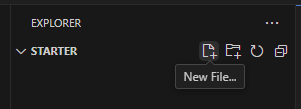

= Lab 2-1 간단한 Python 프로그램 작성

이 연습에서는 Visual Studio Code를 사용하여 간단한 Java 프로그램을 작성합니다. 프로그램은 이름을 물어보고 이름과 함께 안녕 메시지를 출력합니다.

== Python 응용 프로그램 생성

1. Visual Studio Code를 실행합니다.
2. 파일 메뉴에서 폴더 열기를 클릭하고 c:\Labs\Lab2-1\Starter 폴더를 엽니다.
3. 작성자 신뢰 경고 창에서 예, 작성자를 신뢰합니다 버튼을 클릭합니다.
+
image:../images/image01.png[]
+
4. Visual Studio Code 탐색기에서 새 파일 아이콘을 클릭합니다.
+

+
5. 파일 이름을 Greetings.py로 지정합니다.

== 사용자의 이름을 입력받아 메시지를 출력하는 코드 작성

1. input 함수를 호출하고 파라미터로 Enter your name: 문자열을 지정합니다.
2. input 함수의 return 값을 name 변수에 할당합니다.
+
[source, python]
----
name = input("Enter your name: ")
----
+
3. age 변수를 선언하고 input 함수를 통해 입력받은 값을 정수로 변환하여 할당하는 코드를 작성합니다. input 함수의 파라미터로 Enter your age: 문자열을 지정합니다.
+
[source, python]
----
age = int(input("Enter your age: "))
----
+
4. name과 age 변수에 할당 받은 값을 이용해서 "Greetings, [name] [age] years old"를 출력하는 코드를 작성합니다.
5. 작성이 완료된 코드는 아래와 유사할 것입니다.
+
[source, python]
----
name = input("Enter your name: ")
age = int(input("Enter your age: "))
print("Greetings", name, age, "years old")
----
+
6. 파일을 저장합니다.

== 프로그램 실행
1. 터미널 메뉴에서 새 터미널을 클릭합니다.
2. 터미널이 열리면, 아래 명령을 실행하여 코드를 실행합니다.
3. 아래 명령을 수행하여 프로그램을 실행합니다.
+
----
$ python Greetings.py
Enter your name: Celine
Enter your age: 21
Greetings Celine 21 years old
----