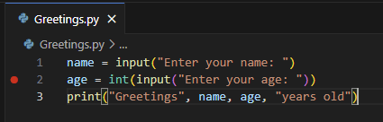
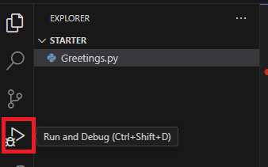
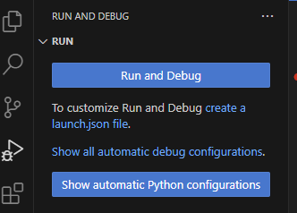
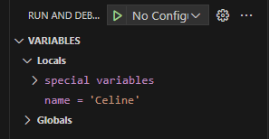

= Lab 2-2 디버깅

이 연습에서는 Visual Studio Code를 사용하여 프로그램을 한 단계씩 실항하고 변수 값을 검사하여 디버깅 하는 작업을 연습합니다.

== Visual Studio Code에서 Breakpoint를 지정하고 디버깅 시작

1. Visual Studio Code 에디터에 열려 있는 Greetings.py 파일에서, 첫 번째 print 함수를 호출하는 코드의 라인 번와 옆을 클릭하여 Breakpoint를 지정합니다.
+

+
2. 왼쪽 메뉴 패널에서 Run and Debug를 클릭합니다.
+

+
3. Run and Debug 버튼을 클릭합니다.
+

+
4. 프로그램이 실행되면, 터미널에서 이름을 입력합니다.
5. 지정한 breakpoint에서 프로그램의 실행이 중단되는 것을 확인합니다.
6. 왼쪽의 실행 및 디버그 창에서, name 변수의 값을 확인합니다.
+

+
7. F10키를 눌러 다음 단계를 실행합니다.
8. 터미널에서 나이를 입력합니다.
9. 실행 및 디버그 창에서, 변수를 확인합니다.
+

+
10. F5 키를 눌러 프로그램 실행을 계속합니다. 터미널 창에서 실행이 완료된 것을 확인합니다.

https://dmoogi.tistory.com/93