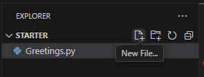
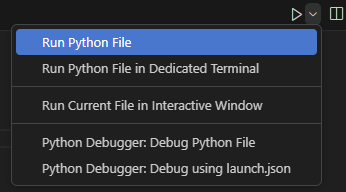
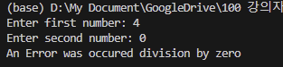

= Lab 2-3 예외 처리

이 연습에서는 예외 처리를 사용하여 예기치 못한 런타임 오류를 처리하는 코드를 작성합니다. 프로그램은 두 개의 정수를 입력하라는 메시지를 표시하고, 첫 번째 정수를 두 번째 정수로 나누고 결과를 출력합니다.

== Python 응용 프로그램 생성

1. visual Studio Code의 탐색기 창에서 새 파일 아이콘을 클릭합니다.
+

+
2. 파일 이름을 Divide.py로 지정합니다.

== 두 정수를 입력받는 코드 작성

1. 첫 번째 정수를 입력받는 코드를 작성합니다.
2. 키보드 표준 입력으로 입력 받은 문자를 정수로 변환하여 i 변수에 할당하는 코드를 작성합니다.
+
[source, python]
----
i = int(input("Enter first number: "))
----
+
3. 같은 방법으로, 두 번째 숫자를 입력받아 j 변수에 할당하는 코드를 작성합니다.
4. 완성된 코드는 아래와 유사할 것입니다.
+
[source, java]
----
i = int(input("Enter first number: "))
j = int(input("Enter second number: "))
----

== 첫 번째 정수를 두 번째 정수로 나누는 코드 작성

1. k 변수를 선언하고 i 변수의 값을 j 변수의 값으로 나눈 값을 k 변수에 할당하는 코드를 작성합니다.
+
[source, python]
----
k = i / j
----
+
2. 값을 출력하는 코드를 작성합니다.
+
[source, python]
----
print("%d / %d = %d" %(i, j, k))
----
+
3. 코드를 저장합니다.

== 프로그램 실행

1. 오른쪽 위, 화살표 옆의 ∨ 기호를 클릭하고 `Run Python File` 을 클릭합니다.
+

+
2. 프로그램이 실행되면, 첫 번째 변수로 4를 입력하고 Enter 키를 누릅니다.
3. 두 번째 변수로 2를 입력하고 Enter 키를 누릅니다.
4. 2가 출력되는 것을 확인합니다.
5. `Run Python File` 을 다시 클릭하여 응용 프로그램을 다시 시작합니다.
6. 첫 번째 변수로 4를 입력합니다.
7. 두 번째 변수로 0을 입력합니다.
8. ZeroDivisionError 에러가 발생하는 것을 확인합니다.
+
----
Enter first number: 4
Enter second number: 0
Traceback (most recent call last):
  File "d:\My Document\GoogleDrive\100 강의자료\Python\Programming with Python\Module 02 Python Programming Language\Lab\Lab2-1\Starter\Divide.py", line 3, in <module>
    k = i / j
        ~~^~~
ZeroDivisionError: division by zero
----

== 예외 처리 코드 작성

1. 전체 코드를 try 블록안에 위치하도록 코드를 수정합니다.
+
[source, python]
----
try:
    i = int(input("Enter first number: "))
    j = int(input("Enter second number: "))
    k = i / j

    print("%d / %d = %d" %(i, j, k))
----
+
2. except 문을 추가합니다. except 문은 예외가 발생했다는 단순한 메시지와 예외 메시지를 출력합니다.
+
[source, python]
----
except ZeroDivisionError as e:
    print("An Error was occured: ", e)
----
+
3. `Run Python File` 을 클릭하여 응용 프로그램을 시작합니다.
4. 첫 번째 변수로 4를 입력합니다.
5. 두 번째 변수로 0을 입력합니다.
6. 예외가 처리되는 것을 확인합니다.
+

