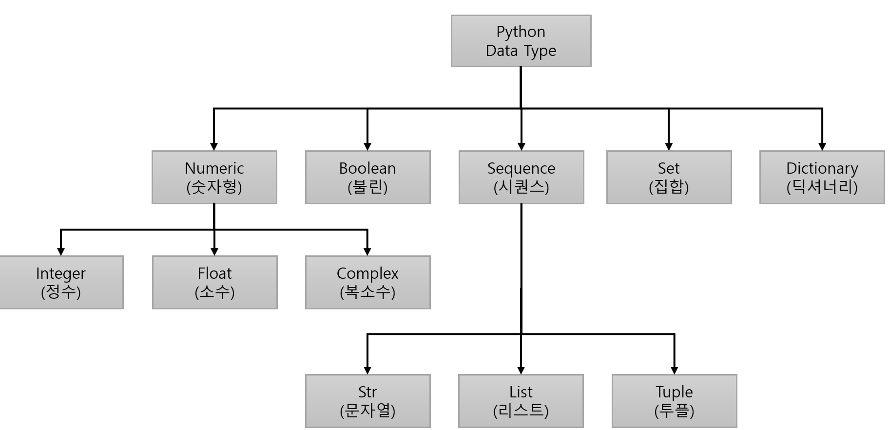

= Python 데이터 타입

---

Python에는 주료 5가지의 데이터 타입이 사용되며, 이 데이터 타입들은 파이썬 기본 라이브러리에 포함되어 있습니다. 

* 숫자형(Numeric) +
숫자형에는 정수(Integer), 실수(Float), 복소수(Complex)가 있습니다. 정수는 양수, 음수, 또는 0이 될 수 있는 숫자를 말합니다. 실수는 소수점이 있는 숫자이며, 복소수는 실수와 허수 요소를 가진 숫자입니다. Python에서 숫자형을 사용하여 기본적인 산술 연산을 수행할 수 있습니다.

* 불린(Boolean) +
True와 False의 두 가지 값을 갖는 자료형입니다.

* 시퀀스(Sequence) +
메모리에 연속적으로 저장되는 요소들을 가지는 데이터 타입으로, 문자열, 리스트, range, 투플등과 같이 값이 연속적으로 이어진 자료형입니다. 이 자료형들은 range, in 등의 공통 기능을 가집니다.

* 집합(Set) +
집합은 중복된 값을 허용하지 않는 유일한 값들의 모임입니다. 순서가 없는 데이터 구조로 인덱스로 접근할 수 없으며, 집합에 특정 값이 포함되어 있는지 확인할 수 있습니다. 또한 집합의 교유 기능들, 즉 교집합, 차집합, 합집합등을 구할 수 있습니다.

* 딕셔너리(Dictionary) +

https://ctkim.tistory.com/entry/Python-%EC%9E%85%EB%AC%B8-%EA%B0%95%EC%A2%8C-5-%EC%9E%90%EB%A3%8C%ED%98%95Date-Type%EC%9D%98-%EC%A2%85%EB%A5%98