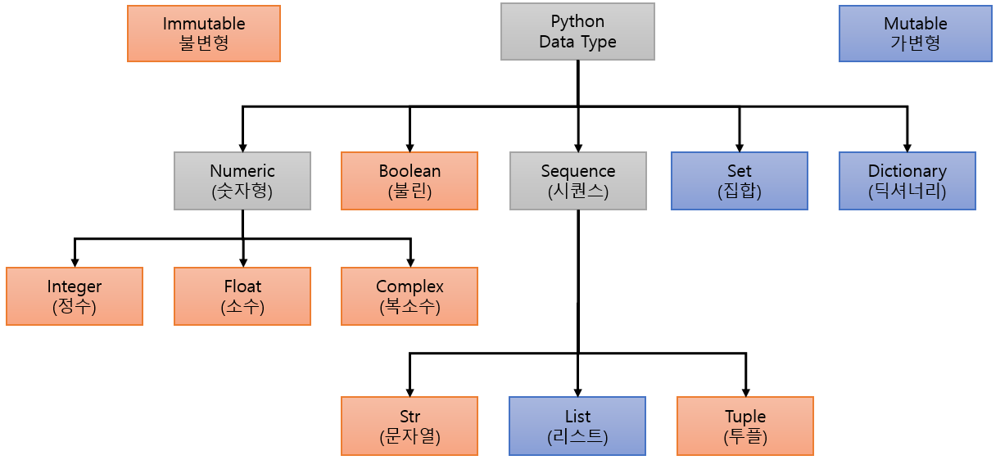

= Immutable 타입과 Mutable 타입

* Python의 타입은 Mutable(가변형)과 Immutable(불변형)으로 나눔
* Immutable(불변형) 타입
** 메모리의 값이 변하지 않는 객체
** 값을 변경할 때 메모리에 새 공간을 할당하고 새로 만듦
* Mutable(가변형) 타입
** 메모리의 값이 직접 변경되는 객체
** 값을 변경하면 메모리에 저장된 값이 변경됨

---

Python의 데이터 타입은 불변형(immutable) 객체와 가변형(mutable) 객체로 분류할 수 있습니다.

불변적 객체(immutable)란, 메모리 안에 담겨 있는 값이 언제나 변하지 않는 객체를 의미합니다. 불변형 타입은 데이터 값을 바꿀 때 메모리에 저장된 데이터 전체를 모두 없애고 새로 만듭니다. 다음과 같은 타입들은 불변 객체입니다.

* 정수형(int) & 불리언형(boolean)
* 실수형(float)
* 복소수형(complex)
* 문자열형(string)
* 튜플형(tuple)
* 바이트형(bytes)
* frozenset형
* decimal 라이브러리의 Decimal형
* range형

가변형 객체(mutable)는 메모리 안에 담겨 있는 값이 변할 수 있는 객체를 의미합니다.다음과 같은 타입들은 가변 객체이다.

* 리스트형(list)
* 집합형(set)
* 사전형(dictionary)
* 바이트 배열형(bytearray)
* 사용자 정의 class형 (이는 사용자가 불변 객체로 정할 수 있지만, 일반적인 경우 가변 객체이다.)

* Immutable 객체

[source, python]
----
a = 1
b = a

print(id(a))
print(id(b))

a = 2

print(id(a))
print(id(b))
----

* Mutable 객체

[source, python]
----
a = [1]
b = a

print(id(a))
print(id(b))
print(b[0])

a[0] = 2

print(id(a))
print(id(b))
print(b[0])
----

https://datascienceschool.net/01%20python/02.14%20%ED%8C%8C%EC%9D%B4%EC%8D%AC%EC%9D%98%20%EC%9E%90%EB%A3%8C%ED%98%95.html