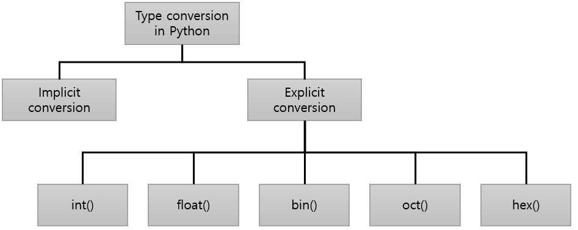

= 명시적 타입 변환

* 명시적 타입 변환에는 일반적으로 타입 변환 함수를 사용

---

명시적 타입 변환은 타입 캐스팅이라고도 하며, 한 데이터 타입에서 다른 데이터 타입으로 값을 변경하는 의도적인 프로세스입니다. 일반적으로 변경하려는 값 앞에 괄호로 데이터 유형을 지정하여 마무리합니다. 예를 들어, (float) 4를 작성하여 숫자 4를 float 또는 10진수로 변경할 수 있습니다.

타입 변환을 사용하면 값에 할당되는 기본 데이터 유형을 재정의하고 대신 선호하는 유형을 지정할 수 있습니다. 프로그램에서 사용되는 데이터 유형을 더 많이 제어할 수 있으며 값이 잘못된 데이터 유형으로 해석된 경우 발생할 수 있는 실수를 피하는 데 도움이 될 수 있습니다.

예를 들어, 부동 소수점 값이 필요한 숫자 4에 대한 수치 연산을 수행하려면 4는 정수이기 때문에 부동 소수점 연산을 수행하지 않습니다. 이런 경우, 타입을 변환하는 함수를 사용할 수 있습니다.

[source, python]
----
f = float(5)
print(type(f))
----

----
<class 'float'>
----

산술 연산 가능 타입을 변환하는 함수는 int()와 float()을 제외하고 문자열(str) 타입 값을 반환합니다.

[source, python]
----
b = bin(5)
print(type(b), b)
----

----
<class 'str'> 0b101
----
