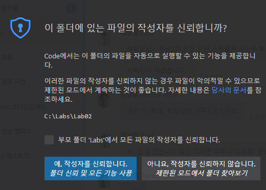

= Lab 4-1 연도 일자를 월/일로 계산

이 연습에서는 표준 입력으로 정수 형식의 일 수 (1에서 385 사이)를 읽어서 월고 일로 변환한 다음 표준 출력하는 프로그램을 작성합니다. 예를 들어 40을 입력하면 “February 9”을 출력합니다. (이 연습에서는 윤년이 무시됩니다)

== 연습 1. 입력받은 숫자로 월/일 계산

**표준 입력에서 숫자 읽기**

1. Visual Studio Code를 엽니다.
2. 파일 메뉴에서 폴더 열기를 클릭하고 c:\Labs\Lab04-1\Strarter 폴더를 엽니다.
3. 작성자 신뢰 경고 창에서, 예, 작성자를 신뢰합니다. 버튼을 클릭합니다.
+

+
4. Visual Studio Code 탐색기에서 Whatday.java 파일을 엽니다.
+

+
5. 1에서 365사이의 숫자를 입력하라는 문자열을 프롬프트에 출력하고 값을 읽어들여 day_num 변수에 정수 타입으로 할당하는 코드를 작성합니다.
6. 작성된 코드는 아래와 유사할 것입니다.
+
[source, python]
----
day_num = int(input("1 에서 365 사이의 숫자를 입력하세요: "))
----
+
7. 파일을 저장합니다.

**일자에서 월/일 계산**

1. month_num 이라는 이름의 변수를 선언하고 0으로 초기화합니다.
2. 1부터 10월까지 날짜와 월을 제공하는 if 절이 제공됩니다. if 문의 주석을 제거하고, 11월과 12월에 해당하는 월 수와 날짜를 계산하는 if 절을 추가합니다.
+
|===
|**Tip** 여러 줄 및 블록 주석을 위해 Visual Studio Code가 제공하는 기능을 사용할 수 있습니다. 편집 메뉴의 줄 주석 설정/해제 기능과 블록 주석 설정/해제 기능을 사용하면 여러 줄 및 블록 주석을 쉽게 설정하고 해제할 수 있습니다. +

|===
+
3. if statement가 끝나는 부분에 month_name 변수를 선언하고 빈 문자열을 할당합니다.
4. 1월부터 10월까지 월 이름을 처리하는 match-case 문이 제공됩니다. match-case 문의 주석을 제거하고 11월과 12월에 대한 두 레이블을 추가하고, default 레이블에 문자열 “Not set”을 추가하는 명령문을 추가합니다.
5. match-case 문 아래에, print 함수를 사용하여 day_num 변수의 값과 month_name 변수의 값을 출력하는 코드를 작성합니다.
6. 완성된 코드는 아래와 유사할 것입니다.
+
[source, python]
----
days_in_month  = [31, 28, 31, 30, 31, 30, 31, 31, 30, 31, 30, 31]
month_names = ["January", "Feburary", "March", "April", "May", "June", "July", "August", "Sepetember", "October", "November", "December"]

day_num = int(input("1 에서 365 사이의 숫자를 입력하세요: "))
month_num = 0

# Todo: if statement로 월 번호와 날짜를 계산합니다
if day_num > 31:    # Januray
    month_num += 1
    day_num -= 31

if day_num >= 28  :   # Feburary
    month_num +=  1
    day_num -= 28

if day_num >= 31:     # March
    month_num += 1
    day_num -= 31

if day_num >= 30:       # April
    month_num += 1
    day_num -= 30

if day_num >= 31:       # May
    month_num += 1
    day_num -= 31

if day_num >= 30:       # June
    month_num += 1
    day_num -= 30

if day_num >= 31:       # July
    month_num += 1
    day_num -= 31

if day_num >= 31:       # August
    month_num += 1
    day_num -= 31

if day_num >= 30:       # September
    month_num += 1
    day_num -= 30

if day_num >= 31:       # October
    month_num += 1
    day_num -= 31

if day_num >= 30:       # November
    month_num += 1
    day_num -= 30

if day_num >= 31:       # December
    month_num += 1
    day_num -= 31

month_name = ""

# match-case statement를 사용해서 월 이름을 할당합니다
match month_num:
    case 0:
        month_name = "January"
    case 1:
        month_name = "Feburary"
    case 2:
        month_name = "March"
    case 3:
        month_name = "April"
    case 4:
        month_name = "May"
    case 5:
        month_name = "June"
    case 6:
        month_name = "July"
    case 7:
        month_name = "August"
    case 8:
        month_name = "September"
    case 9:
        month_name = "October"
    case 10:
        month_name = "November"
    case 11:
        month_name = "December"
    case _:
        month_name = "Not set"

print(f"{day_num}, {month_name}")
----
+
7. Whatday.py 프로그램을 실행합니다. 프로그램의 입력 문자열에 따라 아래와 같은 값이 출력되는지 확인합니다.
+
----
Day number	Month and day
32	        February, 1
60	        March, 1
93	        April, 3
258	        September, 15
335	        December, 1
364	        December, 30
----

**배열을 사용하여 월의 이름을 계산**

1. 월 번호를 사용해서 월 이름을 교체하는 match-case문을 보다 간결하게 변경합니다. Whatday.py 파일의 위에서 month_names 리스트를 확인합니다.
+
[source, python]
----
month_names = ["January", "Feburary", "March", "April", "May", "June", "July", "August", "Sepetember", "October", "November", "December"]
----
+
2. match-case statement 전체를 주석 처리 하거나 삭제합니다.
3. match-case statement 대신 month_name 변수에 month_num 변수의 값에 해당하는 month_names 리스트의 인덱스 값을 할당하는 코드를 작성합니다.
4. 완성된 코드는 아래와 유사할 것입니다.
+
[source, python]
----
days_in_month  = [31, 28, 31, 30, 31, 30, 31, 31, 30, 31, 30, 31]
month_names = ["January", "Feburary", "March", "April", "May", "June", "July", "August", "Sepetember", "October", "November", "December"]

day_num = int(input("1 에서 365 사이의 숫자를 입력하세요: "))
month_num = 0

# if statement를 사용하여 월 번호와 일수를 계산하는 코드

month_name = month_names[month_num]

print(f"{day_num}, {month_name}")
----
+
5. 작업을 저장합니다.
6. Whatday.py 프로그램을 실행합니다. 코드가 줄었지만 프로그램은 동일하게 동작하는 것을 확인합니다.