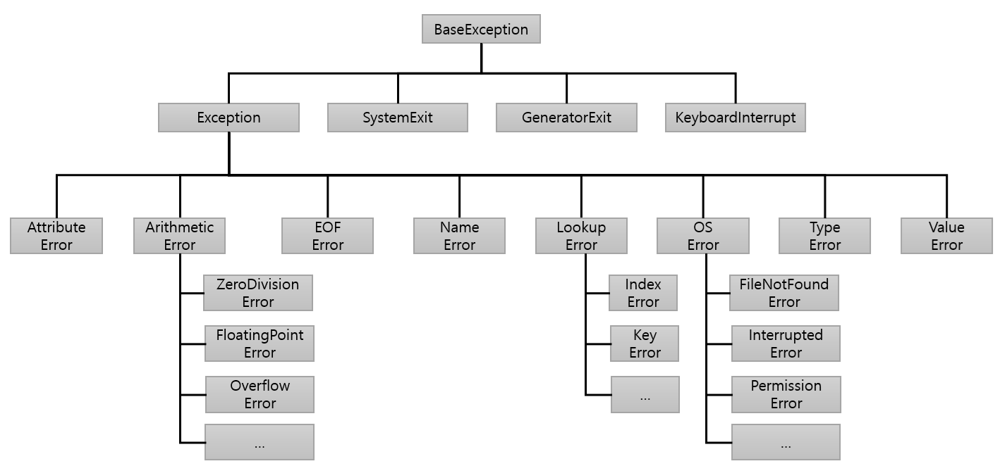

= 예외 객체

* Python에서 모든 예외는 BaseException에서 파생된 클래스 인스턴스

---

파이썬에서, 모든 예외는 BaseException 에서 파생된 클래스의 인스턴스여야 합니다. 특정 클래스를 언급하는 except 절을 갖는 try 문에서, 그 절은 그 클래스에서 파생된 모든 예외 클래스를 처리합니다 (하지만 그것 이 계승하는 예외 클래스는 처리하지 않습니다). 서브 클래싱을 통해 관련되지 않은 두 개의 예외 클래스는 같은 이름을 갖는다 할지라도 결코 등등하게 취급되지 않습니다.

예외는 인터프리터 또는 내장 함수에 의해 생성될 수 있습니다. 언급된 경우를 제외하고, 오류의 자세한 원인을 나타내는 "연관된 값"이 있습니다. 이는 문자열이거나 여러 항목의 정보(예: 오류 코드 및 코드를 설명하는 문자열)의 튜플일 수 있습니다. 연관된 값은 일반적으로 예외 클래스의 생성자에 인수로 전달됩니다.

내장 예외에 대해서는 https://docs.python.org/ko/3/library/exceptions.html[Python 표준 라이브러리]를 참조하십시오.