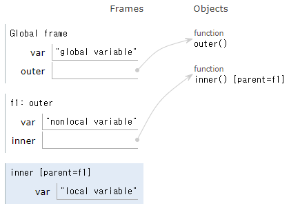

== 변수의 범위

* 변수가 선언된 위치에 따라 영향을 미치는 범위가 달라짐
* 유효 범위(variable scipe)
** 함수 내에 선언된 변수를 지역 변수(local variable)이라고 부름
** 함수 외부에 선언된 변수를 전역 변수(global variable)이라고 부름

---

Python에서는 변수가 선언된 위치에 따라 해당 변수가 영향을 미치는 범위가 달라지며, 이를 변수의 유효 범위(variable scope)이라고 부릅니다. Python에서 변수는 유효 범위에 따라 다음과 같이 나눌 수 있습니다.

* 지역 변수(local variable) +
함수 내에 선언된 변수
* 전역 변수(global variable) +
함수 외부에 선언된 변수

== 지역 변수(local variable)

함수(메소드) 내에 선언딘 변수를 지역 변수라고 하며, 함수 내에 선언된 지역 변수는 일반적으로 함수 내에서만 사용될 수 있습니다. 아래 코드에서, 함수 foo() 내에 선언된 local_varible 변수는 함수 내에서만 유효합니다.

[source, python]
----
def foo():
    local_variable = "local variable"

print(local_variable)
----

----
 File "C:\Code\Test.py", line 4, in <module>
    print(local_variable)
          ^^^^^^^^^^^^^^
NameError: name 'local_variable' is not defined
----

== Variable Shadowing

Python에서는 상위 블록, 하위 블록 관계없이 같은 이름의 변수를 선언할 수 있습니다. 아래 코드에서는 3개의 다른 블록(2개의 블록은 함수)에서 같은 이름의 변수를 선언하고 출력합니다.

[source, python]
----
var = "global variable"
print(var)

def outer():
    var = "nonlocal variable"
    print(var)

    def inner():
        var = "local variable"
        print(var)
    inner()
outer()
----

----
global variable
nonlocal variable
local variable
----

이 세 변수는 실제로 다른 변수지만, 각 함수 블록에서 같은 이름의 변수를 다른 메모리 영역에서 사용합니다. 이런 현상을 Variable Shadowing이라고 부릅니다.

== 전역 변수(global variable)

함수(메소드) 밖에 선언된 변수를 전역 변수(global varible)라고 하며, 모든 곳에서 접근할 수 있습니다.

[source, python]
----
global_variable = "global variable"

def foo():
    local_variable = "local variable"
    print(global_variable)

foo()
print(global_variable)
----

----
global variable
global variable
----

아래 코드는 global_variable 변수와 foo() 함수내의 global_variable 변수가 다른 공간에 선언된 다른 변수임을 보여줍니다.

[source, python]
----
global_variable = "global variable"

def foo():
    global_variable = "local variable"
    print(global_variable)

foo()
print(global_variable)
----

함수 블록 내에서 global 변수를 사용하려면 global 키워드를 사용할 수 있습니다.

[source, python]
----
global_variable = "global variable"

def foo():
    global global_variable
    global_variable = "value changed at foo()"
    print(global_variable)

foo()
print(global_variable)
----

----
value changed at foo()
value changed at foo()
----

함수 내에서도 전역 변수를 선언할 수 있습니다. 함수 내에서 전역 변수를 선언하려면 global 키워드를 사용합니다. 함수내에서 선언되는 전역 변수는 정의(define)와 선언(declare 또는 초기화)가 분리되어야 합니다.

[source, python]
----
def foo():
    local_variable = "local variable"
    global global_variable
    global_variable = "global variable"
    print(global_variable)

foo()

print(global_variable)
----

----
global variable
global variable
----

== nonlocal 변수

nonlocal 변수 역시 global과 마찬가지로 variable shadowing을 회피하기 위해 사용되지만, nonlocal 키워드는 중첩 함수 내에서 상위 함수에 선언된 변수를 하위 함수에서 사용할 수 있도록 합니다.

아래 코드에서 outer() 함수의 nonlocal_variable과 inner() 함수의 nonlocal_variable 은 이름은 같지만 다른 변수로 동작합니다.

[source, python]
----
def outer():
    nonlocal_variable = "declare at outer()"
    print(nonlocal_variable)
    def inner():
        nonlocal_variable = "change at inner()"
        print(nonlocal_variable)
    inner()
    print(nonlocal_variable)

outer()
----

outer() 함수의 nonlocal_variable은 global 변수가 아니므로 global 키워드를 사용하지 않습니다. 이 경우, Variable Shadowing을 피하기 위해 nonlocal 키워드를 사용합니다.

[source, python]
----
def outer():
    nonlocal_variable = "declare at outer()"
    print(nonlocal_variable)
    def inner():
        nonlocal nonlocal_variable
        nonlocal_variable = "change at inner()"
        print(nonlocal_variable)
    inner()
    print(nonlocal_variable)

outer()
----

----
declare at outer()
change at inner()
change at inner()
----