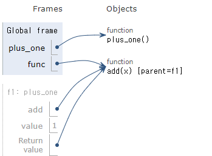
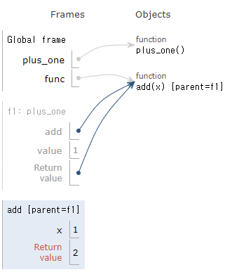
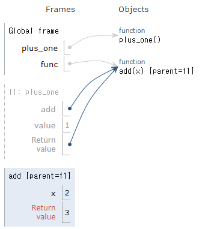

= Closer

* 중첩 함수의 일종
* first-class function을 지원하는 언어에서 유효 범위의 이름을 바인딩하는 기술
* Python에서는 함수와 함수가 사용하는 환경(nonlocal)을 저장

[source, python]
----
def calculator(x):
    def add(y):
        return x + y
    return add
----

---

closer는 중첩 함수의 일종으로, 개념상으로는 중첩 함수의 하위 개념이라고 볼 수 있습니다. closer를 정의하기 위해서는 중첩된 함수가 필요합니다. 원래의 정의는 first-class function을 지원하는 언어에서 유효 범위의 이름을 바인딩하는 기숭ㄹ로서, 함수에 정의된 global도 local도 아닌 nonlocal 변수를 저장하는 것을 closer라고 부릅니다.

cloeser를 쉽게 정의하면, 함수의 return 값으로 내부 함수를 사용하는 함수라고 할 수 있습니다. 함수의 반환값으로 내부 함수를 사용하게 되면 first-class function 속성에 따라 내부 함수를 변수에 저장하고 사용할 수 있습니다.

아래 코드에서, 외부 함수 plus_one()은 내부 함수로 add() 함수를 가집니다.

[source, python]
----
def plus_one():
    value = 1

    def add(x):
        return x + value

    return add
----

plus_one 함수를 호출하면, add 함수를 반환합니다. 아래 코드를 실행하면, 

[source, python]
----
func = plus_one()
----

아래와 같은 상태가 됩니다.

이 상태에서 func() 함수를 호출하면 plus_one() 함수의 내부 함수가 호출됩니다.

func() 함수는 객체이므로 x 값을 저장하고 있습니다. 이 상태에서 func() 함수를 한 번 더 호출하면 아래와 같은 상태가 됩니다.

