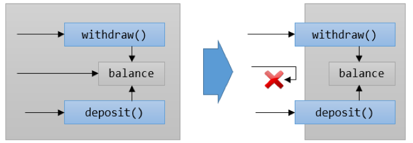
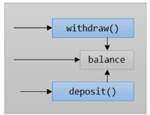

= 접근 가시성 제어

* 메소드는 public, 외부에서 볼 수 있음
* 데이터는 private, 내부에서만 볼 수 있음

---

아래 그림에서 인출(withdraw)과 입금(deposit), 잔액(balance)은 하나의 캡슐안에 단일화 되어 있습니다. 캡슐의 이름을 지정한다면 BankAccount 정도가 될 것입니다.

 
이 경우 심각한 문제가 있습니다. 사용자난 인출과 입금을 거치지 않고 잔액에 액세스 할 수 있습니다. 사람이 은행에 가서 금고 문을 열고 들어갈 수 없듯이, 이는 은행의 업무 방식이 아닙니다. 풀어야 하는 문제와 모델이 일치하지 않습니다.

캡슐화를 도구로 사용하면 이런 문제를 해결할 수 있습니다. 데이터와 기능이 하나로 결합되면 객체가 경계를 만들어 자연스럽게 외부와 내부로 나눕니다. 이 경계를 사용하여 개체의 액세스를 제어할 수 있습니다. 일부 기능과 데이터는 내부에서만 액세스 할 수 있고, 나머지는 내/외부 모두에서 액세스 할 수 있습니다. 경계 안과 밖 모두에서 액세스 할 수 있는 멤버(member)는 `public` 으로 정의되고 내부에서만 액세스 할 수 있는 멤버는 `private` 으로 정의됩니다.

image:../images/image04.png[]

은행 계좌를 모델링할 때 실세계의 은행 계좌에 가깝게 만들기 위해서 입금과 출금에 대한 방법만 외부에서 액세스 할 수 있게 하고 잔액에는 직접 액세스 할 수 없도록 해야 합니다. 잔액을 늘이는 유일한 방법은 입금 동작을 실행하는 것입니다. 잔액은 경계 내부에 있기 때문에 외부에서는 어떤 방법으로도 잔액에 액세스 할 수 없어야 합니다.
 

